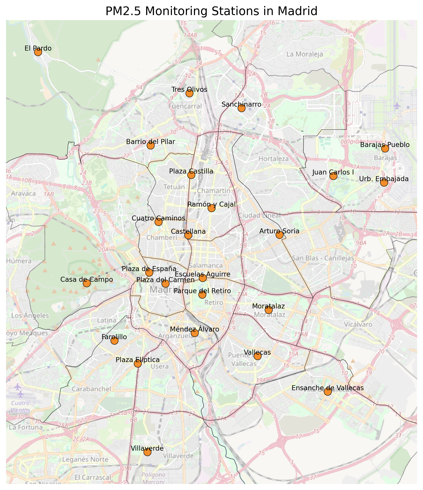
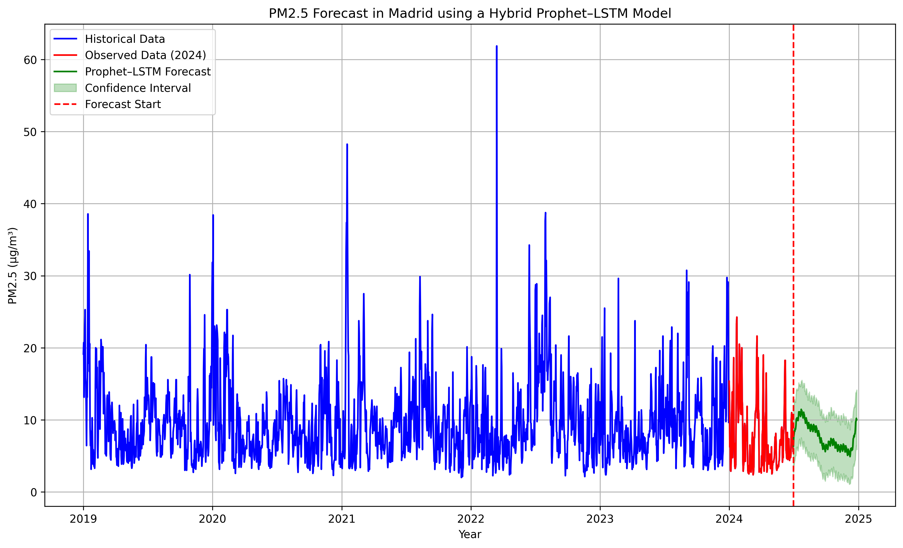

[](https://creativecommons.org/licenses/by/4.0/)
[](https://quarto.org/)
[](https://doi.org/10.3390/appliedmath4040076)
[](https://doi.org/10.5281/zenodo.19659982)


## 🔗 Direct access

-   🧪 [Scripts](scripts.html)
-   💻 [Notebook](notebook.html)
-   📄 [Article](https://doi.org/10.3390/appliedmath4040076)


## 🧠 Overview

This repository provides a **fully reproducible implementation** of the hybrid modelling framework presented in:

**Analysis and Prediction of PM2.5 Pollution in Madrid using Prophet–LSTM hybrid models**

The project integrates:

- Statistical time series forecasting (Prophet)
- Deep learning models (LSTM)
- Environmental and temporal data

The objective is to combine **interpretability and predictive capacity** within a coherent modelling framework.


## 📍 Monitoring stations

{fig-align="center" width="85%"}

**Fig. 1.** Spatial distribution of PM2.5 monitoring stations in Madrid used in the study.


## 🎯 Research motivation

Urban air quality prediction presents several methodological challenges:

-   Strong temporal dependencies
-   Seasonal patterns
-   Nonlinear dynamics
-   Influence of environmental variables

Purely statistical models often lack flexibility, while deep learning approaches may reduce interpretability.

This motivates the use of **hybrid modelling strategies**.


## 🧩 Modelling workflow

The analytical pipeline follows a structured sequence:

1.  **Data acquisition and preprocessing**
    Cleaning, validation, and temporal alignment of PM2.5 data.

2.  **Exploratory analysis**
    Identification of trends, variability, and seasonal patterns.

3.  **Prophet modelling**
    Decomposition of trend and seasonal components.

4.  **LSTM modelling**
    Learning nonlinear temporal dependencies.

5.  **Hybrid integration**
    Combining Prophet outputs with LSTM predictions.


## 📈 Forecasting results

{fig-align="center" width="90%"}

**Fig. 2.** PM2.5 forecasting using the hybrid Prophet–LSTM model, including historical data, observed values, and predicted trend with confidence interval.


## 🧭 Analytical approach

The modelling strategy is guided by the following principles:

-   **Temporal coherence**: preserving chronological structure\
-   **Model complementarity**: combining statistical and deep learning methods\
-   **Reproducibility**: fully script-based implementation\
-   **Interpretability**: maintaining analytical transparency

This approach balances methodological rigour and predictive performance.


## 🗂️ Repository structure

```text

urban-pm25-forecasting/
├── docs/                      # GitHub Pages site
│   ├── index.html
│   ├── scripts.html
│   └── notebook.html
├── data/                      # Processed datasets
├── images/                    # Figures
├── scripts/                   # Python scripts
├── index.qmd
├── scripts.qmd
├── notebook.qmd
├── _quarto.yml
├── LICENSE
└── README.md
```

## ⚙️ Technologies

| Category        | Tools                             |
|-----------------|-----------------------------------|
| Programming     | Python 3.12 · Quarto              |
| Data            | pandas · numpy                    |
| Visualisation   | matplotlib · seaborn              |
| Modelling       | Prophet · TensorFlow/Keras (LSTM) |
| Reproducibility | Git · GitHub Pages · Zenodo       |

## 🔁 Reproducibility

All results are fully reproducible:

-   Scripts implement the complete pipeline

-   Notebook enables step-by-step execution

-   No manual data manipulation

-   Figures generated programmatically

The project relies exclusively on **open-source tools and open data**.

## 🎓 Relation to research

This repository supports ongoing work in:

-   Urban sustainability

-   Environmental data science

-   Hybrid predictive modelling

## 📚 Citation

If you use this work, please cite:

> Cáceres-Tello, J., & Galán-Hernández, J. J. (2024).\
> Analysis and Prediction of PM2.5 Pollution in Madrid: The Use of Prophet–LSTM Hybrid Models.\
> *AppliedMath*, 4(4), 1428–1452.\
> <https://doi.org/10.3390/appliedmath4040076>

## ⚖️ License

-   Code: CC BY 4.0

-   Data: CC0 (where applicable)

## 📬 Contact

Jesús Cáceres Tello
Complutense University of Madrid

📧 [jcaceres.academic\@gmail.com](mailto:jcaceres.academic@gmail.com)
📧 [jescacer\@ucm.es](mailto:jescacer@ucm.es)

⬅️ <https://jcaceres-academic.github.io>

This repository promotes **open, transparent, and reproducible research** in environmental data science.
