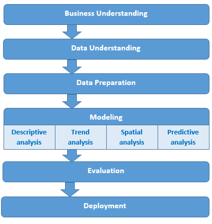

# 📂 Data acquisition and processing

## Analytical context

This notebook implements the reproducible workflow underlying the PM2.5 forecasting study in Madrid. The analysis is based on daily concentration measurements obtained from the urban monitoring network and organised as a structured time series.

At this stage, the objective is not to extract insight but to ensure that the data are consistent, chronologically ordered, and suitable for modelling. Particular attention is given to temporal integrity and the handling of missing observations, as these aspects directly affect downstream performance.

## Monitoring stations

{fig-align="center" width="85%"}

**Fig. 1.** Spatial distribution of PM2.5 monitoring stations in Madrid.

## Spatial variability

{fig-align="center" width="70%"}

**Fig. 2.** Spatial distribution of PM2.5 concentration levels across districts in Madrid.

Although the forecasting task is approached as a temporal problem, spatial variability provides important contextual information. Differences across districts reflect heterogeneous urban dynamics, which indirectly influence the temporal behaviour captured by the models.

# 🔍 Exploratory data analysis

## Analytical workflow

{fig-align="center" width="65%"}

**Fig. 3.** Conceptual workflow of the PM2.5 forecasting process, from data acquisition to model evaluation.

This schematic representation summarises the structure of the analytical pipeline. While simplified, it reflects the sequential nature of the workflow implemented in this study, where each stage builds upon the previous one.

## Temporal structure

Before introducing predictive models, it is necessary to understand the temporal characteristics of the data. The PM2.5 signal combines short-term variability with broader seasonal patterns, reflecting both local dynamics and environmental conditions.

This stage provides a structural understanding of the series rather than an exhaustive exploratory analysis.

------------------------------------------------------------------------

# 📐 Prophet modelling

## Analytical context

Prophet is used as an initial modelling approach due to its ability to decompose the time series into interpretable components such as trend and seasonality. This provides a transparent baseline for understanding the dominant structure of the data.

Rather than focusing on optimisation, the objective is to establish a stable and interpretable reference model.

------------------------------------------------------------------------

# 🤖 LSTM modelling

## Analytical context

To complement the statistical structure captured by Prophet, LSTM networks are introduced to model nonlinear temporal dependencies. These architectures are particularly suited to capturing patterns that evolve over time and are not easily represented through additive components.

The LSTM model focuses on short-term dynamics and local fluctuations.

------------------------------------------------------------------------

# 🔗 Hybrid Prophet–LSTM integration

## Analytical context

The hybrid modelling strategy combines the strengths of both approaches. Prophet captures the global structure of the series, while LSTM refines the prediction by learning nonlinear residual behaviour.

This integration reflects a complementary modelling philosophy, where interpretability and flexibility are balanced.

------------------------------------------------------------------------

# 📈 Forecasting results

{fig-align="center" width="90%"}

**Fig. 4.** PM2.5 forecasting results using the hybrid Prophet–LSTM model.

## Interpretation

The hybrid model produces forecasts that align coherently with observed data, capturing both the underlying trend and short-term variability. This behaviour illustrates the advantage of combining statistical decomposition with sequence-based learning.

------------------------------------------------------------------------

# ⚖️ Model evaluation

## Evaluation strategy

Model performance is assessed using standard forecasting error metrics, ensuring that evaluation reflects realistic predictive conditions. A time-based validation strategy is applied to preserve chronological integrity.

The objective is not to maximise performance metrics, but to ensure methodological coherence and interpretability.

------------------------------------------------------------------------

# 🧭 Methodological implications

The workflow presented in this notebook highlights several important aspects. Preserving temporal structure is essential in environmental forecasting, as random sampling would distort the evaluation process.

In addition, hybrid approaches demonstrate that combining models can be more effective than relying on a single paradigm, particularly when different aspects of the signal must be captured.

Finally, the use of a fully reproducible pipeline ensures transparency and facilitates reuse in future research.

------------------------------------------------------------------------

# 🌐 Repository and citation

All code, data, and materials are openly available at:

➡️ https://github.com/jcaceres-academic/urban-pm25-forecasting

Zenodo archive:

➡️ https://doi.org/10.5281/zenodo.19659982

## Citation

> Cáceres-Tello, J., & Galán-Hernández, J. J. (2024).\
> Analysis and Prediction of PM2.5 Pollution in Madrid: The Use of Prophet–LSTM Hybrid Models.\
> *AppliedMath*, 4(4), 1428–1452.\
> https://doi.org/10.3390/appliedmath4040076

## 📬 Contact

Jesús Cáceres Tello
Complutense University of Madrid

📧 [jcaceres.academic\@gmail.com](mailto:jcaceres.academic@gmail.com)
📧 [jescacer\@ucm.es](mailto:jescacer@ucm.es)

⬅️ <https://jcaceres-academic.github.io>

This repository promotes **open, transparent, and reproducible research** in environmental data science.
